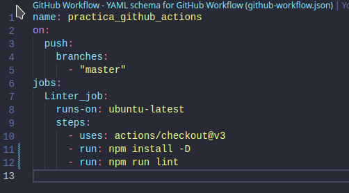

# Practica final eslint

# Introdución teorica

GitHub Actions son una característica de GitHub que permite automatizar el flujo de trabajo de desarrollo. Con ellas, puedes crear "acciones" que se activan cuando se producen eventos específicos en tu repositorio de GitHub. Estas acciones pueden realizar tareas como compilar código, probarlo, implementarlo en un servidor, entre otras. En resumen, ayudan a automatizar tareas repetitivas y a mejorar el flujo de trabajo de desarrollo.

## Eslint:

He creado el workflow con un job llamado Linter_job el cual instala las dependencias del proyecto y ejecuta npm run lint.

## Cypress:

He realizdo los test en local para verificar su funcionamiento.

He añadido el job al workflow, debemos de ponerle id al step del cypress para más tarde poder subir el resultado del job a un artefacto. Además debemos de usar *continue-on-error* para que aunque el step falle los resultados se guarden. Por último debemos de pasarle como parámetros de entrada el *start* con el comando de *npm run dev* para que el preoyecto de Next inicie además del *wait-on* con la URL de Next para que cypress se espere a que el servicio de Next esté listo para realizar los test.

## Badge:

RESULTADO DE LOS ÚLTIMOS TESTS:
<!-- NO CAMBIAR LA URL DE FORMA MANUAL. -->
<!-- SI ES NECESARIO CAMBIAR LA IMAGEN DEL BADGED DEBERAS DE HACERLO EN LA ACTION LOCALIZADA EN .github\actions\badge\index.js -->

Para este job he creado un custom action que recibiendo como entrada el resultado de los tests de cypress y modifica el README dependiendo de estos.

En este job el step del *checkout* recibe una llave privada ssh para que el step *EndBug/add-and-commit* pueda realizar el push al repositorio. Además añadimos *[skip actions]* al mensaje del commit para que este no active nuevamente las actions.

## Deploy:

URL de la web:
https://practica-github-actions-sergimicoortiz.vercel.app/

Para este job me he registrado en la web de vercel y he generado un proyecto.

En el job de Deploy_job simplemente he realizado un *checkout* y luego he utilizado la action de vercel a la cual le he pasado un token que he generado en vercel junto a mi ID de usuario y el ID del proyecto, todo esto en secretos del repositorio. En la propia configuración del proyecto en la web de vercel se especifica que framework se está utilizando para que la propia vercel realice el build del proyecto.

## Notification

Primero he creado la custom action que envía el correo. Utilizo *Mailtrap* para enviar los correos.

Luego he creado el job usuando la action anterior al cual le paso como parámetros de entrado tanto el estado de los jobs como el usuario y contraseña de Mailtrap además de el email al cual le queremos mandar el correo.

## README Metrics:

He generado un token en github, el cual he usado el el workflow.

El workflow genera un svg el cual debeos de poner en el README.md

